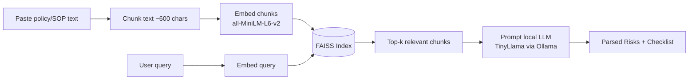

# AI Risk Extractor & Compliance Checklist Generator

An end-to-end **Retrieval-Augmented Generation (RAG)** system that reads policy, SOP, or compliance documents and automatically extracts **key risks** and a **actionable checklist** — powered by a fully local, offline LLM pipeline.

No cloud API keys, no data leaving your machine: documents are embedded, indexed, and reasoned over entirely on-device.

---

## Why this project

Compliance and risk review is manual, slow, and easy to get wrong. This tool takes raw policy text, retrieves the most relevant sections using semantic search, and asks a local LLM to turn that context into a structured, human-readable risk assessment — in seconds, with zero external dependencies.

## Features

- **Semantic document ingestion** — paste any policy/SOP/compliance text and it's chunked and embedded for retrieval
- **Vector search with FAISS** — cosine-similarity search over a local `IndexFlatIP` index for fast, relevant context retrieval
- **Local embeddings** via `sentence-transformers` (`all-MiniLM-L6-v2`)
- **Fully offline inference** using TinyLlama through Ollama — no API keys, no rate limits, no data sent to third parties
- **Structured extraction** — parses free-form LLM output into a clean `risks[]` and `checklist[]` response
- **Persistent local storage** — FAISS index and text store are saved to disk and reloaded on restart
- **Lightweight full-stack app** — FastAPI backend, React + Vite frontend

## How it works



1. **Ingest** — document text is split into ~600-character chunks and embedded into 384-dim vectors.
2. **Index** — vectors are stored in a FAISS `IndexFlatIP` index (inner product on normalized vectors = cosine similarity).
3. **Retrieve** — a user query is embedded and matched against the index to pull the top-k most relevant chunks.
4. **Generate** — the retrieved context + query are sent to a locally running LLM (TinyLlama via Ollama), prompted to return structured `RISKS:` and `CHECKLIST:` sections.
5. **Parse & serve** — the raw LLM output is parsed into a typed JSON response and rendered in the React UI.

## Tech stack

| Layer | Technology |
|---|---|
| LLM inference | Ollama (TinyLlama), fully offline |
| Embeddings | sentence-transformers (`all-MiniLM-L6-v2`) |
| Vector search | FAISS (`IndexFlatIP`, cosine similarity) |
| Backend | FastAPI, Pydantic |
| Frontend | React 18, Vite |
| Persistence | Local disk (FAISS index + JSON text store) |

## Project structure

```
ai-risk-extractor/
├── backend/
│   ├── main.py            # FastAPI app: ingestion, embedding, retrieval, LLM call
│   └── requirements.txt
└── frontend/
    ├── src/
    │   ├── App.jsx         # UI: upload text, ask questions, view results
    │   └── main.jsx
    └── index.html
```

## Getting started

### Prerequisites
- Python 3.10+
- Node.js 18+
- [Ollama](https://ollama.com) installed locally

### 1. Pull the local LLM
```bash
ollama pull tinyllama
ollama serve
```

### 2. Backend
```bash
cd backend
pip install -r requirements.txt
uvicorn main:app --reload --port 8000
```

### 3. Frontend
```bash
cd frontend
npm install
npm run dev
```

Visit `http://localhost:5173`, paste a policy document, then ask a question like *"What are the main risks and what should we do?"*

## API reference

| Endpoint | Method | Description |
|---|---|---|
| `/upload` | `POST` | Chunks, embeds, and indexes document text |
| `/analyze` | `POST` | Retrieves relevant chunks for a query and returns extracted risks + checklist |

**`POST /upload`**
```json
{ "title": "Data Handling Policy", "content": "..." }
```

**`POST /analyze`**
```json
{ "query": "What are the main risks and what should we do?" }
```
```json
{
  "risks": ["..."],
  "checklist": ["..."],
  "used_chunks": ["..."]
}
```
